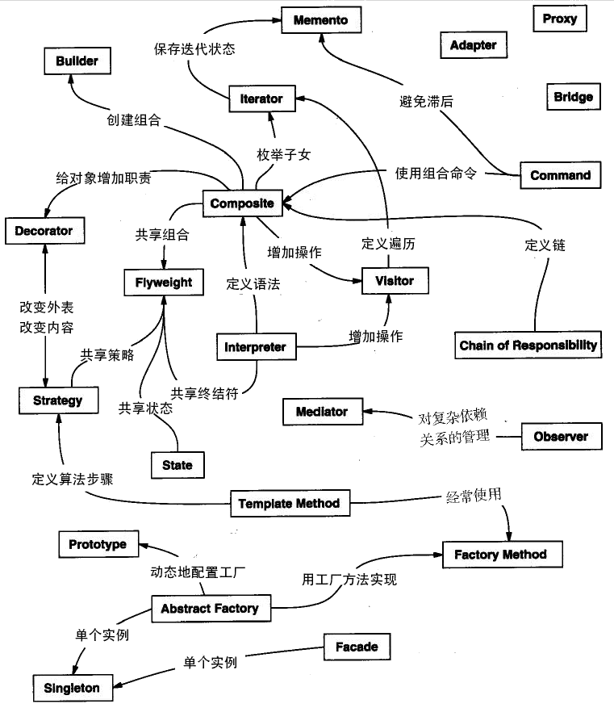

# 设计模式学习笔记

## 一 C语言中文网

### 1 设计模式概述

```
最初用在建筑领域。
概念：
	软件设计模式（Software Design Pattern），又称设计模式，是一套被反复使用、多数人知晓的、经过分类编目的、代码设计经验的总结。它描述了在软件设计过程中的一些不断重复发生的问题，以及该问题的解决方案。也就是说，它是解决特定问题的一系列套路，是前辈们的代码设计经验的总结，具有一定的普遍性，可以反复使用。其目的是为了提高代码的可重用性、代码的可读性和代码的可靠性。
意义：
	可以提高程序员的思维能力、编程能力和设计能力。
    使程序设计更加标准化、代码编制更加工程化，使软件开发效率大大提高，从而缩短软件的开发周期。
    使设计的代码可重用性高、可读性强、可靠性高、灵活性好、可维护性强。
基本要素：
	[模式名称]、别名、动机、[问题]、[解决方案]、[效果]、结构、模式角色、合作关系、实现方法、适用性、已知应用、例程、模式扩展和相关模式等。
```

### 2 分类和功能

| 范围\目的 | 创建型模式                                     | 结构型模式                                                   | 行为型模式                                                   |
| --------- | ---------------------------------------------- | ------------------------------------------------------------ | ------------------------------------------------------------ |
| 类模式    | 工厂方法                                       | (类）适配器                                                  | 模板方法、解释器                                             |
| 对象模式  | 单例<br />原型<br />抽象工厂<br />建造者<br /> | 代理 (对象<br />适配器<br />桥接<br />装饰<br />外观<br />享元<br />组合<br /> | 策略<br />命令<br />职责链<br />状态<br />观察者<br />中介者<br />迭代器<br />访问者<br />备忘录<br /> |

```
单例（Singleton）模式：某个类只能生成一个实例，该类提供了一个全局访问点供外部获取该实例，其拓展是有限多例模式。
原型（Prototype）模式：将一个对象作为原型，通过对其进行复制而克隆出多个和原型类似的新实例。
工厂方法（Factory Method）模式：定义一个用于创建产品的接口，由子类决定生产什么产品。
抽象工厂（AbstractFactory）模式：提供一个创建产品族的接口，其每个子类可以生产一系列相关的产品。
建造者（Builder）模式：将一个复杂对象分解成多个相对简单的部分，然后根据不同需要分别创建它们，最后构建成该复杂对象。
代理（Proxy）模式：为某对象提供一种代理以控制对该对象的访问。即客户端通过代理间接地访问该对象，从而限制、增强或修改该对象的一些特性。
适配器（Adapter）模式：将一个类的接口转换成客户希望的另外一个接口，使得原本由于接口不兼容而不能一起工作的那些类能一起工作。
桥接（Bridge）模式：将抽象与实现分离，使它们可以独立变化。它是用组合关系代替继承关系来实现，从而降低了抽象和实现这两个可变维度的耦合度。
装饰（Decorator）模式：动态的给对象增加一些职责，即增加其额外的功能。
外观（Facade）模式：为多个复杂的子系统提供一个一致的接口，使这些子系统更加容易被访问。
享元（Flyweight）模式：运用共享技术来有效地支持大量细粒度对象的复用。
组合（Composite）模式：将对象组合成树状层次结构，使用户对单个对象和组合对象具有一致的访问性。
模板方法（TemplateMethod）模式：定义一个操作中的算法骨架，而将算法的一些步骤延迟到子类中，使得子类可以不改变该算法结构的情况下重定义该算法的某些特定步骤。
策略（Strategy）模式：定义了一系列算法，并将每个算法封装起来，使它们可以相互替换，且算法的改变不会影响使用算法的客户。
命令（Command）模式：将一个请求封装为一个对象，使发出请求的责任和执行请求的责任分割开。
职责链（Chain of Responsibility）模式：把请求从链中的一个对象传到下一个对象，直到请求被响应为止。通过这种方式去除对象之间的耦合。
状态（State）模式：允许一个对象在其内部状态发生改变时改变其行为能力。
观察者（Observer）模式：多个对象间存在一对多关系，当一个对象发生改变时，把这种改变通知给其他多个对象，从而影响其他对象的行为。
中介者（Mediator）模式：定义一个中介对象来简化原有对象之间的交互关系，降低系统中对象间的耦合度，使原有对象之间不必相互了解。
迭代器（Iterator）模式：提供一种方法来顺序访问聚合对象中的一系列数据，而不暴露聚合对象的内部表示。
访问者（Visitor）模式：在不改变集合元素的前提下，为一个集合中的每个元素提供多种访问方式，即每个元素有多个访问者对象访问。
备忘录（Memento）模式：在不破坏封装性的前提下，获取并保存一个对象的内部状态，以便以后恢复它。
解释器（Interpreter）模式：提供如何定义语言的文法，以及对语言句子的解释方法，即解释器。
```

### 3 UML统一建模语言


```
统一建模语言
UML 能为软件开发的所有阶段提供模型化和可视化支持。
```

### 4 UML类图&类图关系

```
耦合度从弱到强：依赖关系、关联关系、聚合关系、组合关系、泛化关系和实现关系。其中泛化和实现的耦合度相等，它们是最强的。
```


```
1. 依赖关系
依赖（Dependency）关系是一种使用关系，它是对象之间耦合度最弱的一种关联方式，是临时性的关联。在代码中，某个类的方法通过局部变量、方法的参数或者对静态方法的调用来访问另一个类（被依赖类）中的某些方法来完成一些职责。

在 UML 类图中，依赖关系使用带箭头的虚线来表示，箭头从使用类指向被依赖的类。如下是人与手机的关系图，人通过手机的语音传送方法打电话。
```


```
2. 关联关系
关联（Association）关系是对象之间的一种引用关系，用于表示一类对象与另一类对象之间的联系，如老师和学生、师傅和徒弟、丈夫和妻子等。关联关系是类与类之间最常用的一种关系，分为一般关联关系、聚合关系和组合关系。我们先介绍一般关联。

关联可以是双向的，也可以是单向的。在 UML 类图中，双向的关联可以用带两个箭头或者没有箭头的实线来表示，单向的关联用带一个箭头的实线来表示，箭头从使用类指向被关联的类。也可以在关联线的两端标注角色名，代表两种不同的角色。

在代码中通常将一个类的对象作为另一个类的成员变量来实现关联关系。如下是老师和学生的关系图，每个老师可以教多个学生，每个学生也可向多个老师学，他们是双向关联。
```


```
3. 聚合关系
聚合（Aggregation）关系是关联关系的一种，是强关联关系，是整体和部分之间的关系，是 has-a 的关系。

聚合关系也是通过成员对象来实现的，其中成员对象是整体对象的一部分，但是成员对象可以脱离整体对象而独立存在。例如，学校与老师的关系，学校包含老师，但如果学校停办了，老师依然存在。

在 UML 类图中，聚合关系可以用带空心菱形的实线来表示，菱形指向整体。如下是大学和教师的关系图。
```


```
4.组合关系
组合（Composition）关系也是关联关系的一种，也表示类之间的整体与部分的关系，但它是一种更强烈的聚合关系，是 cxmtains-a 关系。

在组合关系中，整体对象可以控制部分对象的生命周期，一旦整体对象不存在，部分对象也将不存在，部分对象不能脱离整体对象而存在。例如，头和嘴的关系，没有了头，嘴也就不存在了。

在 UML 类图中，组合关系用带实心菱形的实线来表示，菱形指向整体。如下是头和嘴的关系图。
```


```
5.泛化关系
泛化（Generalization）关系是对象之间耦合度最大的一种关系，表示一般与特殊的关系，是父类与子类之间的关系，是一种继承关系，是 is-a 的关系。

在 UML 类图中，泛化关系用带空心三角箭头的实线来表示，箭头从子类指向父类。在代码实现时，使用面向对象的继承机制来实现泛化关系。例如，Student 类和 Teacher 类都是 Person 类的子类，其类图如下所示。
```


```
6.实现关系
实现（Realization）关系是接口与实现类之间的关系。在这种关系中，类实现了接口，类中的操作实现了接口中所声明的所有的抽象操作。

在 UML 类图中，实现关系使用带空心三角箭头的虚线来表示，箭头从实现类指向接口。例如，汽车和船实现了交通工具，其类图如下所示。
```

### 5 类关系记忆技巧


### 6 UMLet使用

### 7 优秀设计的特征

```
代码复用
扩展性
```

### 8 正确使用设计模式

```
1. 需求驱动
不仅仅是功能性需求，需求驱动还包括性能和运行时的需求，如软件的可维护性和可复用性等方面。设计模式是针对软件设计的，而软件设计是针对需求的，一定不要为了使用设计模式而使用设计模式，否则可能会使设计变得复杂，使软件难以调试和维护。
2. 分析成功的模式应用项目
对现有的应用实例进行分析是一个很好的学习途径，应当注意学习已有的项目，而不仅是学习设计模式如何实现，更重要的是注意在什么场合使用设计模式。
3. 充分了解所使用的开发平台
设计模式大部分都是针对面向对象的软件设计，因此在理论上适合任何面向对象的语言，但随着技术的发展和编程环境的改善，设计模式的实现方式会有很大的差别。在一些平台下，某些设计模式是自然实现的。

不仅指编程语言，平台还包括平台引入的技术。例如，Java EE 引入了反射机制和依赖注入，这些技术的使用使设计模式的实现方式产生了改变。
4. 在编程中领悟模式
软件开发是一项实践工作，最直接的方法就是编程。没有从来不下棋却熟悉定式的围棋高手，也没有不会编程就能成为架构设计师的先例。掌握设计模式是水到渠成的事情，除了理论只是和实践积累，可能会“渐悟”或者“顿悟”。
5.避免设计过度
设计模式解决的是设计不足的问题，但同时也要避免设计过度。一定要牢记简洁原则，要知道设计模式是为了使设计简单，而不是更复杂。如果引入设计模式使得设计变得复杂，只能说我们把简单问题复杂化了，问题本身不需要设计模式。
```



### 9 开闭原则

```
对扩展开放，对修改关闭
作用：
1 测试
2 复用
3 维护
```

### 10  里氏替换原则

```
继承必须确保超类所拥有的性质在子类中仍然成立
即：子类继承父类时，除添加新的方法完成新增功能外，尽量不要重写父类的方法。
作用：
1 开闭扩充
2 克服父类重写导致复用性变差
3 动作正确性的保证？
4 鲁棒性 兼容性 维护性 可扩展性
实现方法：
1 实现父类的抽象方法，不能覆盖父类的非抽象方法
2 可以增加自己特有的方法
3 重载父类的方法时，前置条件（即方法的输入参数）要比父类更宽松
4 实现父类的方法时（重写/重载或实现抽象方法），后置条件（即方法的的输出/返回值）要比父类更严格或相等
```

### 11 依赖倒置原则（面向对象设计原则）

```
高层模块不应该依赖低层模块，两者都应该依赖其抽象；抽象不应该依赖细节，细节应该依赖抽象
核心思想是：要面向接口编程，不要面向实现编程。
作用：
1 降低类间的耦合性。
2 提高系统的稳定性。
3 减少并行开发引起的风险。
4 提高代码的可读性和可维护性。
实现方法：
1 每个类尽量提供接口或抽象类，或者两者都具备。
2 变量的声明类型尽量是接口或者是抽象类。
3 任何类都不应该从具体类派生。
4 使用继承时尽量遵循里氏替换原则。
```

### 12 单一职责原则

```
单一职责原则规定一个类应该有且仅有一个引起它变化的原因，否则类应该被拆分
降低类颗粒度
1 降低类的复杂度。
2 提高类的可读性。
3 提高系统的可维护性。
4 变更引起的风险降低。
```

### 13 接口隔离原则（面向对象设计原则）

```
一个类对另一个类的依赖应该建立在最小的接口上
降低接口颗粒度
作用：
提高系统的灵活性和可维护性。
降低了系统的耦合性。
能够保证系统的稳定性
使用多个专门的接口还能够体现对象的层次，因为可以通过接口的继承，实现对总接口的定义。
能减少项目工程中的代码冗余。
实现方法：
接口尽量小，但是要有限度。
只提供调用者需要的方法，屏蔽不需要的方法。
每个项目或产品都有选定的环境因素，环境不同，接口拆分的标准就不同深入了解业务逻辑。
提高内聚，减少对外交互。使接口用最少的方法去完成最多的事情。
```

### 14 迪米特法则

```
最少知识原则
设计中间类
作用：
1 降低了类之间的耦合度，提高了模块的相对独立性。
2 由于亲合度降低，从而提高了类的可复用率和系统的扩展性。
实现方法：
1 在类的划分上，应该创建弱耦合的类。
2 在类的结构设计上，尽量降低类成员的访问权限。
3 在类的设计上，优先考虑将一个类设置成不变类。
4 在对其他类的引用上，将引用其他对象的次数降到最低。
5 不暴露类的属性成员，而应该提供相应的访问器（set 和 get 方法）。
6 谨慎使用序列化（Serializable）功能。
```

### 15 合成复用原则（面向对象设计原则）

```
优先使用组合或者聚合等关联关系来实现，其次才考虑使用继承关系来实现。

通常类的复用分为继承复用和合成复用两种
继承复用虽然有简单和易实现的优点，但它也存在以下缺点。
继承复用破坏了类的封装性。因为继承会将父类的实现细节暴露给子类，父类对子类是透明的，所以这种复用又称为“白箱”复用。
子类与父类的耦合度高。父类的实现的任何改变都会导致子类的实现发生变化，这不利于类的扩展与维护。
它限制了复用的灵活性。从父类继承而来的实现是静态的，在编译时已经定义，所以在运行时不可能发生变化。

采用组合或聚合复用时，可以将已有对象纳入新对象中，使之成为新对象的一部分，新对象可以调用已有对象的功能，它有以下优点。
它维持了类的封装性。因为成分对象的内部细节是新对象看不见的，所以这种复用又称为“黑箱”复用。
新旧类之间的耦合度低。这种复用所需的依赖较少，新对象存取成分对象的唯一方法是通过成分对象的接口。
复用的灵活性高。这种复用可以在运行时动态进行，新对象可以动态地引用与成分对象类型相同的对象。
```

### 16 七大原则总结

| 设计原则     | 一句话归纳                                                   | 目的                                       |
| ------------ | ------------------------------------------------------------ | ------------------------------------------ |
| 开闭原则     | 对扩展开放，对修改关闭                                       | 降低维护带来的新风险                       |
| 依赖倒置原则 | 高层不应该依赖低层，要面向接口编程                           | 更利于代码结构的升级扩展                   |
| 单一职责原则 | 一个类只干一件事，实现类要单一                               | 便于理解，提高代码的可读性                 |
| 接口隔离原则 | 一个接口只干一件事，接口要精简单一                           | 功能解耦，高聚合、低耦合                   |
| 迪米特法则   | 不该知道的不要知道，一个类应该保持对其它对象最少的了解，降低耦合度 | 只和朋友交流，不和陌生人说话，减少代码臃肿 |
| 里氏替换原则 | 不要破坏继承体系，子类重写方法功能发生改变，不应该影响父类方法的含义 | 防止继承泛滥                               |
| 合成复用原则 | 尽量使用组合或者聚合关系实现代码复用，少使用继承             | 降低代码耦合                               |


## 二 设计模式精解

### 1 介绍及6原则

创建型、结构型、行为型、并发型和线程池型。

1. 开闭原则：对扩展开放，对修改关闭。

2. 单一职责原则：不要存在多余一个导致类变更的原因。
3. 里氏替换原则：任何基类可以出现的地方，子类一定可以出现。
4. 依赖倒转原则：面向接口编程，依赖于抽象而不依赖于具体。写代码时用到具体类时，不与具体类交互，而与具体类的上层接口交互。（没看懂）
5. 接口隔离原则：每个接口中不存在子类用不到却必须实现的方法。
6. 迪米特法则：一个类对自己依赖的类知道的越少越好。
7. 合成复用原则：尽量首先使用合成/聚合的方式，而不是使用继承。

### 2 创建型模式

#### 2.1 Factory模式

两个最重要的功能：

1.  定义创建对象的接口，封装了对象的创建。

   我的理解：也就是将对象创建集合到基类当中。

   

2. 使得具体化类的工作延迟到了子类中。

   我的理解：将基类方法的实现下放到子类当中。

   

#### 2.2 AbstractFactory模式

将这一组对象的创建封装到一个用于创建对象的类中。

实际上，AbstractFactory 模式是为创建一组（有多类）相关或依赖的对象提 供创建接口，而Factory 模式正如我在相应的文档中分析的是为一类对象提供创建接口或延 迟对象的创建到子类中实现。并且可以看到，AbstractFactory 模式通常都是使用 Factory 模式实现（ConcreteFactory1）。


#### 2.3 Singleton模式

企业考察最多的模式。

static类变量（属于整个类，而不是某个对象）需要在cpp中显式初始化。

```c++
Singleton( Singleton const& ) = delete;
Singleton& operator=( Singleton const& ) = delete;//C++11中防止拷贝
```

特点：

1. 私有构造函数
2. 私有static成员变量，类外部初始化。
3. get()或者instance()获得唯一实例
4. restart进行初始化

Singleton 模式经常和 Factory（AbstractFactory）模式在一起使用，因为系统中工厂对象 一般来说只要一个。


#### 2.4 Builder模式

将一个复杂对象的构建与它的表示分离，使得同样的构建过程可以创建不同的表示。（将build过程抽象出来一个类）

builder强调过程，AbstractFactory强调结果。


#### 2.5 Prototype模式

实际上Prototype模式和Builder模式、AbstractFactory 模式都是通过一个类（对象实例）来专门负责对象的创建工作（工厂对象），它们之间的区别是：Builder模式重在复杂对象的一步步创建（并不直接返回对象），AbstractFactory 模式重在产生多个相互依赖类的对象，而 Prototype 模式重在从自身复制自己创建新类。


创建者模式总结：根据生产需求抽象出的类。（过程【builder】、结果【factory】、复制【prototype】、抽象【abstractfactory】）

### 3 结构型模式

#### 3.1 Bridge模式

在 Bridge 模式的结构图中可以看到，系统被分为两个相对独立的部分，左边是抽象部 分，右边是实现部分，这两个部分可以互相独立地进行修改。

通过对象组合实现用户的需求。

Favor Composition Over Inheritance（先组合后继承）。

我的理解：在新抽象出来的类构造的同时初始化一个已存在的基类。


#### 3.2 Adapter模式

类模式的 Adapter 采用private继承的方式复用 Adaptee 的接口，而在对象模式的 Adapter 中我们则采用组合的方式实现 Adaptee 的复用。

接口继承和实现继承是面向对象领域的两个重要的概念，接口继承指的是通过继承， 子类获得了父类的接口，而实现继承指的是通过继承子类获得了父类的实现（并不统共接口）。

> （接口继承与实现继承）
>
> 1. 接口继承和实现继承不同。在public继承之下，派生类总是继承基类的接口。
> 2. pure virtual函数只具体指定接口继承
> 3. impure virtual（普通虚函数）函数具体指定接口继承及缺省实现继承
> 4. non-virtual(普通的非虚函数) 函数具体指定接口继承以及强制性实现继承
> 5. private继承关闭所有函数接口和现实继承。

> 成员权限：
>
> public:可以被任意实体访问（可以外部调用）
>
> protected:只允许子类及本类的成员函数访问（不可以外部调用）
>
> private:只允许本类的成员函数访问（不可以继承）
>
> 基类成员权限--继承方式--子类中成员权限
>
> public ＆ public继承 => public
>
> public ＆ protected继承 => protected
>
> public ＆ private继承 = > private
>
> protected ＆ public继承 => protected
>
> protected ＆ protected继承 => protected
>
> protected ＆ private继承 = > private
>
> private ＆ public继承 => 子类无权访问
>
> private ＆ protected继承 => 子类无权访问
>
> private ＆ private继承 = > 子类无权访问


#### 3.3 Decorator模式


#### 3.4 Composite模式

#### 3.5 Flyweight模式

#### 3.6Facade模式

#### 3.7 Proxy模式

### 4 行为模式

#### 4.1 Template模式

#### 4.2 Strategy模式

#### 4.3 State模式

#### 4.4 Observer模式

#### 4.5 Memento模式

#### 4.6 Mediator模式

#### 4.7 Command模式

#### 4.8 Vistor模式

#### 4.9 Chain of Resposibility模式

#### 4.10 Iterator模式

#### 4.11 Interpreter模式

## [三 OSG中的设计模式](http://www.3wwang.cn/html/article_104.html)

