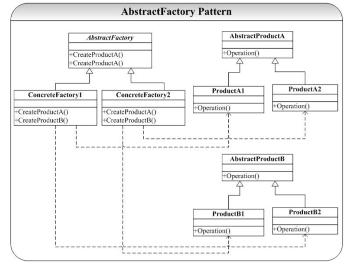
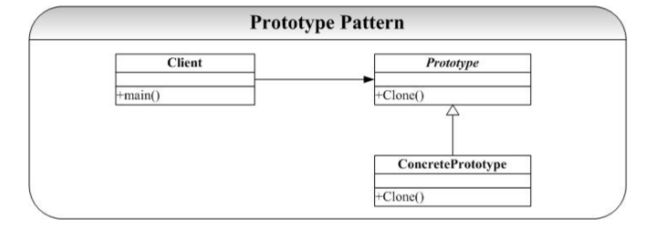
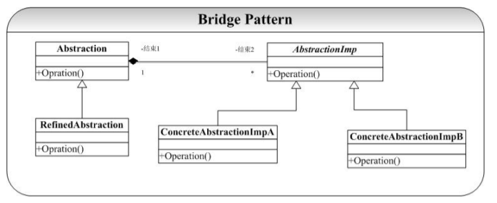

## 设计模式学习笔记

### 1 介绍及6原则

创建型、结构型、行为型、并发型和线程池型。

总则：对扩展开放，对修改关闭。

1. 单一职责原则：不要存在多余一个导致类变更的原因。
2. 里氏替换原则：任何基类可以出现的地方，子类一定可以出现。
3. 依赖倒转原则：面向接口编程，依赖于抽象而不依赖于具体。写代码时用到具体类时，不与具体类交互，而与具体类的上层接口交互。（没看懂）
4. 接口隔离原则：每个接口中不存在子类用不到却必须实现的方法。
5. 迪米特法则：一个类对自己依赖的类知道的越少越好。
6. 合成服用原则：尽量首先使用合成/聚合的方式，而不是使用继承。

### 2 创建型模式

#### 2.1 Factory模式

两个最重要的功能：

1.  定义创建对象的接口，封装了对象的创建。

   我的理解：也就是将对象创建集合到基类当中。

   

2. 使得具体化类的工作延迟到了子类中。

   我的理解：将基类方法的实现下放到子类当中。

   

#### 2.2 AbstractFactory模式

将这一组对象的创建封装到一个用于创建对象的类中。

实际上，AbstractFactory 模式是为创建一组（有多类）相关或依赖的对象提 供创建接口，而Factory 模式正如我在相应的文档中分析的是为一类对象提供创建接口或延 迟对象的创建到子类中实现。并且可以看到，AbstractFactory 模式通常都是使用 Factory 模式实现（ConcreteFactory1）。



#### 2.3 Singleton模式

企业考察最多的模式。

static类变量（属于整个类，而不是某个对象）需要在cpp中显式初始化。

```c++
Singleton( Singleton const& ) = delete;
Singleton& operator=( Singleton const& ) = delete;//C++11中防止拷贝
```

特点：

1. 私有构造函数
2. 私有static成员变量，类外部初始化。
3. get()或者instance()获得唯一实例
4. restart进行初始化

Singleton 模式经常和 Factory（AbstractFactory）模式在一起使用，因为系统中工厂对象 一般来说只要一个。


#### 2.4 Builder模式

将一个复杂对象的构建与它的表示分离，使得同样的构建过程可以创建不同的表示。（将build过程抽象出来一个类）

builder强调过程，AbstractFactory强调结果。


#### 2.5 Prototype模式

深拷贝对应两块内存区域。浅拷贝对应两个变量指向的同一片内存区域。

实际上Prototype模式和Builder模式、AbstractFactory 模式都是通过一个类（对象实例）来专门负责对象的创建工作（工厂对象），它们之间的区别是：Builder模式重在复杂对象的一步步创建（并不直接返回对象），AbstractFactory 模式重在产生多个相互依赖类的对象，而 Prototype 模式重在从自身复制自己创建新类。



创建者模式总结：根据生产需求抽象出的类。（过程【builder】、结果【factory】、复制【prototype】、抽象【abstractfactory】）

### 3 结构型模式

#### 3.1 Bridge模式

在 Bridge 模式的结构图中可以看到，系统被分为两个相对独立的部分，左边是抽象部 分，右边是实现部分，这两个部分可以互相独立地进行修改。

通过对象组合实现用户的需求。

Favor Composition Over Inheritance（先组合后继承）。

我的理解：在新抽象出来的类构造的同时初始化一个已存在的基类。



#### 3.2 Adapter模式

类模式的 Adapter 采用private继承的方式复用 Adaptee 的接口，而在对象模式的 Adapter 中我们则采用组合的方式实现 Adaptee 的复用。

接口继承和实现继承是面向对象领域的两个重要的概念，接口继承指的是通过继承， 子类获得了父类的接口，而实现继承指的是通过继承子类获得了父类的实现（并不统共接口）。

虚函数具有继承多态性。

> （接口继承与实现继承）
>
> 1. 接口继承和实现继承不同。在public继承之下，派生类总是继承基类的接口。
> 2. pure virtual函数只具体指定接口继承
> 3. impure virtual（普通虚函数）函数具体指定接口继承及缺省实现继承
> 4. non-virtual(普通的非虚函数) 函数具体指定接口继承以及强制性实现继承
> 5. private继承关闭所有函数接口和现实继承。

> 成员权限：
>
> public:可以被任意实体访问（可以外部调用）
>
> protected:只允许子类及本类的成员函数访问（不可以外部调用）
>
> private:只允许本类的成员函数访问（不可以继承）
>
> 基类成员权限--继承方式--子类中成员权限
>
> public ＆ public继承 => public
>
> public ＆ protected继承 => protected
>
> public ＆ private继承 = > private
>
> protected ＆ public继承 => protected
>
> protected ＆ protected继承 => protected
>
> protected ＆ private继承 = > private
>
> private ＆ public继承 => 子类无权访问
>
> private ＆ protected继承 => 子类无权访问
>
> private ＆ private继承 = > 子类无权访问


#### 3.3 Decorator模式


#### 3.4 Composite模式

#### 3.5 Flyweight模式

#### 3.6Facade模式

#### 3.7 Proxy模式

### 4 行为模式

#### 4.1 Template模式

#### 4.2 Strategy模式

#### 4.3 State模式

#### 4.4 Observer模式

#### 4.5 Memento模式

#### 4.6 Mediator模式

#### 4.7 Command模式

#### 4.8 Vistor模式

#### 4.9 Chain of Resposibility模式

#### 4.10 Iterator模式

#### 4.11 Interpreter模式
